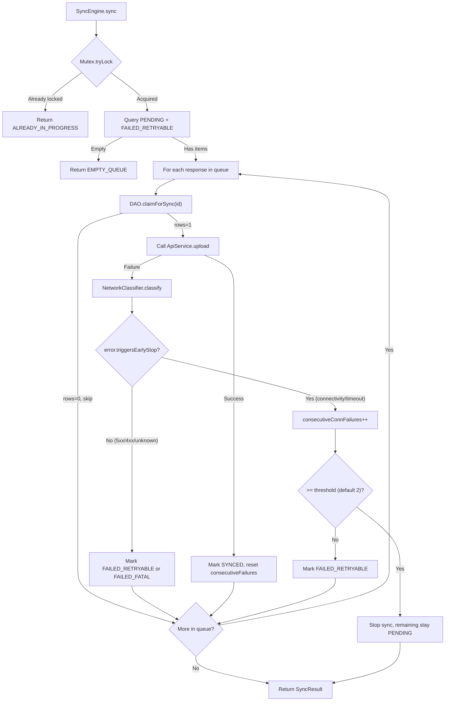

# Architecture Decision Records

## 1. Architecture Choice

**Clean Architecture with Repository Pattern** — Domain models are pure Kotlin (no Android framework deps), the data layer (Room entities, DAOs, mapper) is isolated behind a `SurveyRepository` interface, and the UI layer uses Compose + ViewModel with unidirectional data flow.

**Why not MVVM-only?** A thin domain layer lets us unit-test the sync engine on JVM without Android instrumentation. The repository abstraction also makes swapping FakeSurveyApiService trivial.

**Alternative considered: MVI with Redux-like store.** Rejected as over-engineering for this scope — the sync engine's `SyncProgress` SharedFlow already provides a natural event stream.

## 2. Sync Engine Implementation (Core Design)

The sync engine (`SyncEngine`) orchestrates uploading locally stored survey responses to the server with concurrency control, per-item claim pattern, and early-stop on consecutive connectivity failures.

**Flow summary:**

1. **Mutex.tryLock()** — If another sync is running, return `ALREADY_IN_PROGRESS` immediately (no blocking).
2. **Fetch eligible** — Query repository for responses with status `PENDING` or `FAILED_RETRYABLE`, ordered by `createdAt`.
3. **Per item:** call **claimForSync(id, expectedStatus)** (optimistic lock); if 0 rows affected, skip. Upload via `SurveyApiService`; on success → **markSynced**, on failure → **NetworkClassifier.classify** → mark `FAILED_RETRYABLE` or `FAILED_FATAL`. If the error **triggersEarlyStop** (e.g. `ConnectException`, `SocketTimeoutException`), increment consecutive counter; when counter ≥ 2, **stop sync** and leave remaining items `PENDING` with `NETWORK_UNAVAILABLE`.
4. Emit **SyncProgress** (Starting, Uploading, ItemCompleted, Finished) on a SharedFlow for the UI.

**Core design diagram:**

**Key decisions:** No `SYNCING` in DB (in-memory only, avoids stuck state after crash). Claim pattern prevents double-upload. Early-stop only for connectivity/timeout (not for HTTP 5xx/4xx). Per-response atomic status updates.

## 3. Media File Upload Extension

To extend to real attachment uploads:

1. **Compression pipeline**: Before upload, compress images (JPEG quality 75, max 1920px) in a `MediaProcessor` coroutine worker.
2. **Staged uploads**: Upload attachments first (resumable chunked upload), get server attachment IDs, then upload the response payload referencing those IDs.
3. **Per-attachment status**: Add `AttachmentEntity.status` (PENDING/UPLOADED/FAILED) and extend the claim pattern per attachment.
4. **Retry with partial resume**: Track `uploadedBytes` to resume interrupted large file transfers.

## 4. Network Detection False Positives

The sync engine deliberately avoids `ConnectivityManager` — it reports OS-level connectivity which is often wrong (WiFi captive portal, connected but no internet). Instead, we rely on **actual upload failures** as the ground truth.

**Known false positive**: A very slow server causing `SocketTimeoutException` (connect timeout) triggers early-stop even though the network itself is fine. **Mitigation**: Differentiate connect timeout (network issue) vs read timeout (server slow) — only connect timeouts should increment the early-stop counter. In production, a dedicated "ping" endpoint with aggressive timeout (2s) could validate connectivity before starting a sync batch.

## 5. Remote Troubleshooting Strategy

For field agents in rural Sub-Saharan Africa with limited connectivity:

1. **Structured sync journal**: Log every sync event (`SyncProgress`) to a local `sync_events` Room table with timestamps, response IDs, error codes, and network type (WiFi/cellular).
2. **Diagnostic export**: "Export Sync Log" button in settings generates a JSON file that agents can share via WhatsApp/email.
3. **Last-sync metadata**: Store last sync result + device info (OS version, free storage, battery level) — surfaceable via a remote config flag to enable periodic background reporting when connectivity resumes.
4. **Error aggregation**: On the server side, batch-ingest sync journals to detect patterns (e.g., all agents in region X failing with timeout → server capacity issue vs one agent always failing → device/app issue).

## 6. GPS / Geospatial Challenges

Field surveys in rural East Africa face:

- **Low GPS accuracy** under tree canopy or cloudy conditions (50-100m error). Mitigation: Kalman filtering over multiple readings, minimum accuracy threshold (< 20m) before accepting a fix.
- **Farm boundary mapping**: Multiple GPS points define a polygon. Validation: ensure polygon is closed, area is plausible (0.1–100 ha), no self-intersections. Store as GeoJSON in the answer JSON.
- **Offline map tiles**: Pre-download satellite imagery for the target region at zoom level 15-17 using a tile cache (e.g., Mapbox offline packs).
- **Altitude data**: Useful for crop yield models but phone barometric altitude is unreliable. Use SRTM elevation data lookup from coordinates.

## 7. What Would Be Different With More Time

- **WorkManager integration**: Background periodic sync with exponential backoff, battery/network constraints.
- **Real HTTP client**: Replace FakeSurveyApiService with Ktor/OkHttp + Retrofit, with proper certificate pinning.
- **Conflict resolution**: Server-side idempotency keyed on response UUID; handle "already received" responses gracefully.
- **Attachment upload**: Full chunked upload pipeline with compression and resume.
- **Hilt DI**: Replace manual AppContainer with Hilt for scalability.
- **UI tests**: Compose UI tests with ComposeTestRule for each screen.
- **Accessibility**: Full TalkBack support, minimum contrast ratios verified, RTL layout testing.
- **Offline map integration**: Embedded map view for GPS coordinate visualization.
